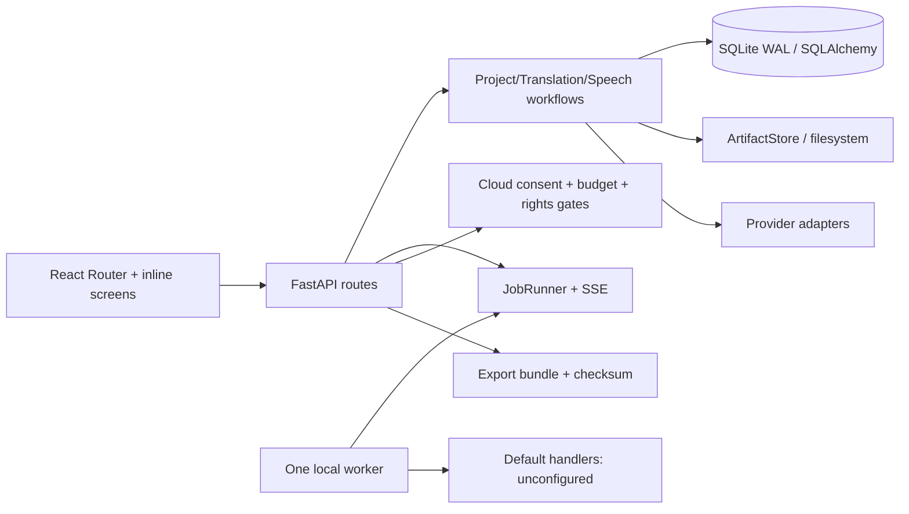

# Kiến trúc hiện tại

## Boundary thực tế

- `run-studio.bat` khởi động API và worker loopback; settings khóa `127.0.0.1`, port 8765, concurrency 1.
- SQLite bật WAL/FK/busy timeout. Project/Chapter/SourceRevision giữ dữ liệu truyện và immutable source snapshots.
- TranslationWorkflow nhận `TranslatorAdapter`, nhưng resolve profile trong workflow; route còn có factory provider riêng. Translation từng segment chạy đồng bộ trong request và commit cuối run.
- GlossaryEntry và StoryMemoryEntry có revision/hash; TranslationRun/Segment có provider/model/prompt/cache/hash/approval. TM hiện truyền rỗng.
- JobRunner có lease/heartbeat/retry/cancel/recovery; `build_default_handlers()` vẫn trả handler báo chưa cấu hình cho mọi JobKind.
- Voice/Speech/Artifact/Export đã có domain state; production voice preview/player và durable chunk render chưa nối đầy đủ.
- Credential writer dùng keyring nhưng Qwen reader format không tương thích; Gemini route dùng localStorage và ID consent/budget mặc định giả định.

## Invariants cần bảo toàn

Source/translation/audio revisions bất biến; approval theo expected hash; rights/cloud/budget fail-closed; artifact checksum; export manifest; manual upload sang app chính; local-only default; fake audio luôn gắn nhãn demo; không tự khẳng định paid smoke thành công.

Chi tiết evidence và debt: [current-system-analysis.md](../research/current-system-analysis.md).
