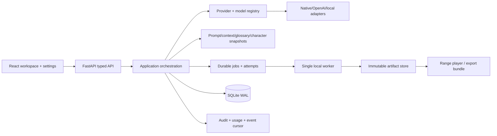

# Kiến trúc đích đã chọn (Q01 C · Q02 C · Q03 C · Q04 C)

## Boundaries

`api` chỉ validate command và trả typed error; `application` tạo execution plan và điều phối; `domain` giữ state machine/invariants; `providers` thực hiện wire contract; `jobs` lease/retry/checkpoint; `artifacts` checksum/atomic writes; `ui` hiển thị state, không chứa credential/policy.

Một `ExecutionPlan` bất biến liên kết project/chapter/source revision, provider profile revision, requested/resolved model, prompt/style/glossary/context hashes, capability, consent, budget và fallback policy. Mỗi attempt ghi request id, actual model, usage confidence, latency, error và artifact pointer.

## Luồng provider

`ProviderRegistry.resolve()` kiểm tra profile enabled, credential reference, language/capability, context, rate card, rights/consent/budget rồi trả plan. `ProviderAdapter` chỉ nhận plan + request envelope. Fallback gọi lại resolver/policy trước dispatch; không fallback ẩn trong adapter.

## Luồng job

UI tạo job idempotency key; worker claim lease, đọc immutable input, gọi provider ngoài transaction dài, ghi segment artifact/result, heartbeat và commit ngắn. Retry theo error classifier; timeout sau gửi là billing unknown. Event sequence là append-only, query cursor.

## Luồng context

ContextEngine lấy approved summaries/entity/addressing, locked glossary, exact TM và style; cắt theo relevance/token budget, ghi selection trace. Sửa upstream tạo invalidation plan tới translation, speech, master và export.

## Luồng audio

Approved translation → `SpeechSegment` jobs → immutable VieNeu artifact → probe → master/resample → SRT → player/review → export. Voice capability manifest là nguồn cho UI controls; one narrator mặc định.

## Data evolution

Ưu tiên mở rộng bảng hiện có và thêm `model_snapshots`, `execution_plans`, `job_attempt_inputs`/`approved_summaries` hoặc character relationship chỉ khi Q01/Q03 chấp thuận. Không thêm Story/Translation/Audio bảng trùng entity hiện tại.

## Operational constraints

Loopback-only, one worker trong Phase 1, data root D:, keyring secrets, SQLite Backup API/VACUUM INTO, no Redis/Celery. Q01 C cho phép scalable routing/event projection/knowledge memory và multi-tab UI, nhưng mỗi phần phải có ADR, benchmark và rollback; không âm thầm bật concurrency hoặc cloud/local runtime mới.
