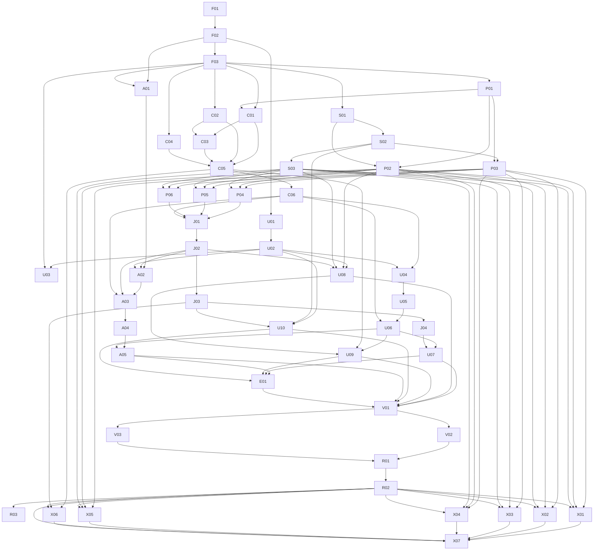

# Kế hoạch triển khai nâng cấp Truyện Audio Studio

Phiên bản 2 · 08/09/2026 · **Trạng thái: kế hoạch bàn giao; các task implementation chưa được thực hiện trong lượt soạn tài liệu này.**

Baseline: **Q01 C** kiến trúc mở rộng được; **Q02 C** multi-document tabs/dock; **Q03 C** chưa bật Ollama/LM Studio/local LLM trong Phase 1; **Q04 C** Quality/Maximum opt-in. VieNeu local TTS vẫn thuộc Phase 1. Không dùng “COMPLETE/LOCKED” để ngụ ý đã chạy benchmark, cloud hoặc audio.

## 1. Phạm vi và nguồn quyết định

Nâng cấp tại chỗ FastAPI/SQLAlchemy/SQLite WAL/filesystem + React/Vite, một worker concurrency 1; giữ revision, import hiện hữu, manual export sang app chính. Không thêm Redis/Celery, không tự upload, không triển khai local LLM Phase 1. Catalog/routing/circuit breaker/event projection/structured character memory thuộc core; vector và năm provider mở rộng ở Phase 2 có feature flag.

Thứ tự áp dụng: yêu cầu trực tiếp của người dùng → [ADR-0001](../architecture/adr/0001-locked-subdecisions.md) → [contract bổ sung C01–C08](../specs/implementation-contracts.md) → [master spec](../specs/master-spec.md) và spec chuyên đề → plan này. Research là bằng chứng/khuyến nghị có ngày, không tự ghi đè quyết định C/C/C/C. Khi có mâu thuẫn mới, sửa tài liệu/fixture liên quan trước mã phụ thuộc; không tự mở lại quyết định của người dùng.

Đọc thêm [prompt gốc](../operations/Prompt%20cho%20Codex%20%E2%80%94%20Research,%20Spec%20%26%20Plan%20n%C3%A2ng%20c%E1%BA%A5p%20d%E1%BB%B1%20%C3%A1n%20d%E1%BB%8Bch%20truy%E1%BB%87n.md), [current-system-analysis](../research/current-system-analysis.md), [provider-research](../research/provider-research.md), [model-research](../research/model-research.md), [translation-engine-research](../research/translation-engine-research.md), [vieneu-tts-research](../research/vieneu-tts-research.md), [ui-ux-research](../research/ui-ux-research.md), ba research v2, [testing plan](testing-plan.md) và [migration plan](migration-plan.md).

Runtime đã đối chiếu manifest: Python >=3.12,<3.13; Node >=24,<25; FastAPI/Pydantic/SQLAlchemy/Alembic, React 19/Router 7/Vite 7, pytest/mypy, Vitest/Playwright. Phiên bản package cụ thể theo lock/manifest hiện tại; không tự nâng dependency trong refactor. Đường dẫn dưới tương đối repo, là vị trí hiện hữu hoặc vị trí dự kiến có ghi “mới”; xác nhận module tương đương trước khi tạo để không nhân domain.

## 2. Quy tắc thực thi và hoàn thành task

- Mỗi task là một thay đổi có thể review độc lập: cập nhật contract test cần thiết → triển khai phạm vi task → test mục tiêu → ghi evidence. Không gộp tám adapter hoặc toàn workspace thành một commit.
- **Phụ thuộc** là nguồn duy nhất cho DAG. Chỉ bắt đầu implementation khi mọi phụ thuộc đã hoàn tất. Có thể đọc/thiết kế trước nhưng không tính là task đã triển khai. Các task đủ điều kiện đồng thời chỉ chạy song song khi khác file sở hữu; migration/schema/shared API phải phối hợp hoặc làm tuần tự.
- C01–C08 trong trường “Ghi chú kỹ thuật” là contract section, không phải task C01–C06. ID task được xác định bằng heading và trường Phụ thuộc.
- Hoàn tất task khi có diff đúng phạm vi, acceptance đạt, test và command/exit code được ghi, migration/rollback được chứng minh nếu có schema. Nếu phụ thuộc môi trường chưa có, ghi BLOCKED hoặc NOT_RUN và feature disabled; không đánh dấu test xanh.
- Secrets chỉ backend keyring; request provisioning được chứa secret transient theo C06, request inference chỉ gửi profile ID. Không secret trong browser persistence/response/log/URL/SQLite plaintext.
- Cloud dispatch phải qua revision/credential/capability/rights/consent/quote/budget; unknown billing không tự resend; không tự free→paid. Không gọi cloud trả phí, tải model hoặc xin quyền mới chỉ để đóng checklist.
- Source/translation/audio/export giữ revision/hash/audit; draft không phải approved output. Migration additive, giữ artifact cũ; backup và rollback trước rollout. Tất cả mô tả người dùng bằng tiếng Việt, identifier kỹ thuật giữ nguyên.

## 3. Milestone và cổng kết thúc

| Milestone | Kết quả bắt buộc trước khi đóng |
|---|---|
| M0 | F01–F03: baseline/restore và typed contracts/schema tương thích |
| M1 | S01–S03, P01–P02: credential/guard/quote và catalog kiểm chứng bằng fixture |
| M2 | P03–P06: ba adapter Phase 1 qua contract; live là trạng thái riêng |
| M3 | C01–C06: prompt/style, glossary/TM, character/summary và QA/revision |
| M4 | J01–J04: worker/recovery/cancel/breaker, projections và draft stream |
| M5 | U01–U10: design system, import/library/dock/editor và đủ bảy nhóm Settings |
| M6 | A01–A05: voice preview, segment/part-master, Range player và review |
| M7 | E01, V01–V03, R01–R03: export, kiểm định, rollout/tài liệu; cleanup ở release sau |
| M8 | X01–X07: mở rộng có điều kiện, không chặn release Phase 1 |

Milestone là nhóm bàn giao, không bắt buộc chờ toàn milestone trước nếu DAG đã đủ. Phase 1 bàn giao ở R02; R03 dọn mã ở release sau. Phase 2 chỉ bắt đầu sau R02; feature thiếu account/model/evidence vẫn disabled và được báo riêng, không tính là đã live verified.

## 4. Task chi tiết

## M0 — Nền tảng và hợp đồng

### F01 — Ghi baseline và phục hồi bản sao

**Mục tiêu:** Ghi baseline và phục hồi bản sao để bàn giao phần chức năng này độc lập.

**File/module dự kiến:** `README.md`; `backend/pyproject.toml`; `frontend/package.json`; `backend/app/modules/storage/backup.py`; `docs/validation/baseline.md`.

**Phụ thuộc:** Không.

**Thay đổi chi tiết:** Chụp phiên bản/dependency, test hiện hữu; backup bằng SQLite Backup API, manifest checksum và restore vào data root riêng; ghi command/exit code và lỗi baseline.

**Ghi chú kỹ thuật:** C03; chưa migration trước khi có điểm phục hồi.

**Tiêu chí nghiệm thu:** Bản sao integrity_check và artifact pointers hợp lệ; dữ liệu gốc không đổi; mỗi test có PASS/FAIL/NOT_RUN.

**Kiểm thử bắt buộc:** Backend/frontend baseline; backup/restore fixture.

**Rủi ro và xử lý:** Snapshot WAL sai; dùng Backup API, không copy riêng file DB đang chạy.

### F02 — Hiện thực kiểu snapshot và lỗi

**Mục tiêu:** Hiện thực kiểu snapshot và lỗi để bàn giao phần chức năng này độc lập.

**File/module dự kiến:** `backend/app/contracts.py`; `backend/app/modules/execution/contracts.py (mới)`; `backend/tests/contracts/ (mới)`.

**Phụ thuộc:** F01.

**Thay đổi chi tiết:** Ánh xạ toàn bộ C01–C02 sang typed model, canonical hash và parser v1; khóa fixture request/response hiện hữu cho compatibility.

**Ghi chú kỹ thuật:** C01–C02 là input thiết kế, task viết mã theo contract đã chốt.

**Tiêu chí nghiệm thu:** Round-trip mọi kiểu; hash ổn định; unknown giữ null; malformed/version lạ bị chặn.

**Kiểm thử bắt buộc:** Serialization, hash, schema và compatibility fixture; mypy.

**Rủi ro và xử lý:** Đổi ID/enum cũ gây hỏng dữ liệu; giữ adapter đọc legacy.

### F03 — Thêm snapshot và liên kết job bằng migration

**Mục tiêu:** Thêm snapshot và liên kết job bằng migration để bàn giao phần chức năng này độc lập.

**File/module dự kiến:** `backend/app/db/models.py`; `backend/migrations/versions/`; `backend/tests/db/`.

**Phụ thuộc:** F02.

**Thay đổi chi tiết:** Thêm execution_snapshots; liên kết Job/JobAttempt/UsageLedger và profile revision theo C03; unique/FK/index, backfill unknown và reader legacy.

**Ghi chú kỹ thuật:** Migration mới additive, không chỉnh migration đã phát hành.

**Tiêu chí nghiệm thu:** Migration chạy trên fixture cũ; không nhân entity; FK/unique chặn payload sai; legacy vẫn đọc được.

**Kiểm thử bắt buộc:** Upgrade fixture, constraint, rollback trên bản sao.

**Rủi ro và xử lý:** Backfill bịa provenance; chỉ null/unknown khi không có evidence.

## M1 — Credential, guard và catalog

### S01 — Thống nhất keyring và vòng đời credential

**Mục tiêu:** Thống nhất keyring và vòng đời credential để bàn giao phần chức năng này độc lập.

**File/module dự kiến:** `backend/app/api/cloud_profiles.py`; `backend/app/modules/security/credentials.py (mới)`; `backend/app/providers/qwen_mt.py`; `backend/app/providers/gemini_mt.py`.

**Phụ thuộc:** F03.

**Thay đổi chi tiết:** Canonical service/username, đọc ref legacy, set/resolve/rotate/delete; profile view chỉ trả configured/status; API credential theo C04.

**Ghi chú kỹ thuật:** C02/C04/C06; secret transient chỉ trong request provisioning.

**Tiêu chí nghiệm thu:** Gemini/Qwen cùng resolve key đã cấu hình; rotate làm revision cũ không dispatch được; keyring lỗi fail-closed.

**Kiểm thử bắt buộc:** Fake-keyring round-trip, legacy ref, rotate/revoke/unavailable.

**Rủi ro và xử lý:** Mất secret cũ; giữ legacy reader và báo nhập lại có lý do.

### S02 — Chặn rò key và bảo vệ API loopback

**Mục tiêu:** Chặn rò key và bảo vệ API loopback để bàn giao phần chức năng này độc lập.

**File/module dự kiến:** `backend/app/api/security.py`; `backend/app/api/payload.py`; `frontend/src/shared/api.ts`; `frontend/src/routes/router.tsx`; `backend/tests/security/`.

**Phụ thuộc:** S01.

**Thay đổi chi tiết:** Bỏ key khỏi localStorage và request dịch; thêm origin/CSRF và endpoint allowlist; redact request/error/diagnostics; xử lý legacy key không tự gửi cloud.

**Ghi chú kỹ thuật:** Chỉ nhập/thay key mới được chứa secret trong body transient.

**Tiêu chí nghiệm thu:** Request inference chỉ có profile ID; không key trong response/storage/log/query URL; origin sai và CSRF thiếu bị chặn.

**Kiểm thử bắt buộc:** Request capture provisioning/inference riêng; XSS/storage regression; path/host negative cases.

**Rủi ro và xử lý:** Redaction bỏ sót body provider; error allowlist, không passthrough.

### S03 — Quote và reservation cho từng stage

**Mục tiêu:** Quote và reservation cho từng stage để bàn giao phần chức năng này độc lập.

**File/module dự kiến:** `backend/app/modules/execution/authorization.py (mới)`; `backend/app/api/translation.py`; `backend/app/modules/compliance/`; `backend/app/db/models.py`.

**Phụ thuộc:** S02.

**Thay đổi chi tiết:** Resolve plan hash, quote TTL, rights/consent/credential/capability/budget; reserve/settle/release ledger; chặn giá unknown thiếu rate card; kiểm lại trước dispatch.

**Ghi chú kỹ thuật:** C06; ceiling ADR không đồng nghĩa đã được cấp authorization.

**Tiêu chí nghiệm thu:** Quote đổi revision/hết hạn bị từ chối; tổng reservation không vượt ceiling; approve translate không cho phép polish.

**Kiểm thử bắt buộc:** Rights/consent/budget matrix, concurrent reservation, expired quote, duplicate settlement.

**Rủi ro và xử lý:** Vượt tiền hoặc dùng quyền cũ; compare revision trong transaction ngắn.

### P01 — Registry và descriptor có capability

**Mục tiêu:** Registry và descriptor có capability để bàn giao phần chức năng này độc lập.

**File/module dự kiến:** `backend/app/providers/registry.py (mới)`; `backend/app/providers/catalog.py (mới)`; `backend/app/settings/`.

**Phụ thuộc:** F03.

**Thay đổi chi tiết:** Descriptor/factory nhận authorization; curated seed có nguồn/ngày; profile disable, unknown capability và fallback allowlist; routes không tự tạo adapter.

**Ghi chú kỹ thuật:** C02; thêm provider qua descriptor/adapter, không sửa domain workflow.

**Tiêu chí nghiệm thu:** Resolve đúng profile revision; disabled/unsupported/unknown bị chặn đúng thao tác; fake registry dùng cùng boundary.

**Kiểm thử bắt buộc:** Registry/capability/filter matrix.

**Rủi ro và xử lý:** Hard-code model quay lại routes; catalog là nguồn duy nhất.

### P02 — Discovery cache và API model phân trang

**Mục tiêu:** Discovery cache và API model phân trang để bàn giao phần chức năng này độc lập.

**File/module dự kiến:** `backend/app/providers/catalog.py`; `backend/app/api/models.py (mới)`; `backend/tests/providers/`.

**Phụ thuộc:** P01, S01.

**Thay đổi chi tiết:** Discovery cursor/ETag/TTL 24h/cooldown; giữ snapshot cũ khi lỗi; expose filter language/context/free/paid/quality provenance và stale.

**Ghi chú kỹ thuật:** C01/C02/C04; benchmark badge tách curated recommendation.

**Tiêu chí nghiệm thu:** Non-200 khác empty; refresh không nằm trong translation request; unknown price không thành free; trang tối đa 100.

**Kiểm thử bắt buộc:** Pagination, notModified, stale/outage, region/account fixtures.

**Rủi ro và xử lý:** Provider drift; source snapshot bất biến và explicit unavailable.

## M2 — Transport và provider Phase 1

### P03 — Transport HTTP và parser stream dùng chung

**Mục tiêu:** Transport HTTP và parser stream dùng chung để bàn giao phần chức năng này độc lập.

**File/module dự kiến:** `backend/app/providers/transport.py (mới)`; `backend/tests/providers/transport/ (mới)`.

**Phụ thuộc:** S02, P01.

**Thay đổi chi tiết:** HTTP auth/header, timeout/cancel, parser SSE incremental, error normalization và usage confidence; không đặt retry trong transport.

**Ghi chú kỹ thuật:** C02/C06; native payload không ép qua chat schema.

**Tiêu chí nghiệm thu:** Frame chia giữa UTF-8/JSON vẫn parse đúng; malformed và disconnect có billingState; không log key.

**Kiểm thử bắt buộc:** 400/401/403/404/429/5xx/timeout/malformed/truncated SSE fixtures.

**Rủi ro và xử lý:** Retry hai tầng; transport chỉ báo lỗi, policy do J02 sở hữu.

### P04 — Sửa adapter Gemini native

**Mục tiêu:** Sửa adapter Gemini native để bàn giao phần chức năng này độc lập.

**File/module dự kiến:** `backend/app/providers/gemini_mt.py`; `backend/tests/providers/`.

**Phụ thuộc:** P03, P02, S03.

**Thay đổi chi tiết:** Map request/response native Gemini theo provider-research và fixture; nối guard, usage/finishReason/actual model; parser segment IDs.

**Ghi chú kỹ thuật:** Chỉ kết luận contract pass, không kết luận cloud đã chạy.

**Tiêu chí nghiệm thu:** Không bypass guard; success/error/stream fixtures đủ; actual chưa xác nhận giữ null.

**Kiểm thử bắt buộc:** Bộ contract provider và credential capture; smoke live riêng.

**Rủi ro và xử lý:** Wire drift; pin fixture nguồn/ngày và chặn schema lạ.

### P05 — Sửa adapter Qwen-MT native

**Mục tiêu:** Sửa adapter Qwen-MT native để bàn giao phần chức năng này độc lập.

**File/module dự kiến:** `backend/app/providers/qwen_mt.py`; `backend/tests/providers/`.

**Phụ thuộc:** P03, P02, S03.

**Thay đổi chi tiết:** Map source/target language, native MT payload/context theo research; tách chat builder; usage/error/request ID và giới hạn model.

**Ghi chú kỹ thuật:** Phase 1 sau contract/credential/guard đạt; không đẩy Qwen sang Phase 2.

**Tiêu chí nghiệm thu:** Không gửi system chat field trái native contract; output gắn segment IDs; không fallback âm thầm.

**Kiểm thử bắt buộc:** Native request/response, language, context overflow, error matrix.

**Rủi ro và xử lý:** Nhầm Qwen chat với MT; apiKind bắt buộc.

### P06 — Thêm adapter OpenRouter

**Mục tiêu:** Thêm adapter OpenRouter để bàn giao phần chức năng này độc lập.

**File/module dự kiến:** `backend/app/providers/openrouter.py (mới)`; `backend/tests/providers/`.

**Phụ thuộc:** P03, P02, S03.

**Thay đổi chi tiết:** Dùng transport chat nhưng lưu requested/resolved model và routing provenance; fallback chỉ allowlist đã authorize.

**Ghi chú kỹ thuật:** C02/C06; source provider metadata cần snapshot.

**Tiêu chí nghiệm thu:** Model thực tế khác request được ghi rõ; billing unknown không retry; giá/free metadata không suy diễn từ tên.

**Kiểm thử bắt buộc:** Routing/usage/finish/error/stream fixtures.

**Rủi ro và xử lý:** Router thay model ngoài policy; reject hoặc đánh unverifiable theo capability.

## M3 — Prompt, glossary và memory có revision

### C01 — Profile ngôn ngữ, phong cách và prompt builder

**Mục tiêu:** Profile ngôn ngữ, phong cách và prompt builder để bàn giao phần chức năng này độc lập.

**File/module dự kiến:** `backend/app/modules/translation/prompt_builder.py (mới)`; `backend/app/db/models.py`; `backend/app/api/translation.py`; `backend/migrations/versions/`.

**Phụ thuộc:** F03, P01.

**Thay đổi chi tiết:** Thêm style revision C03; preset thể loại/tone/ngôn ngữ và custom instruction; build envelope chat/native riêng; source là untrusted data.

**Ghi chú kỹ thuật:** C01–C03/C06; Balanced mặc định, Quality/Maximum opt-in.

**Tiêu chí nghiệm thu:** Đổi style tạo revision/hash mới; source không được thực thi như instruction; expected IDs giữ thứ tự.

**Kiểm thử bắt buộc:** Prompt snapshot/injection, native/chat builder, Unicode.

**Rủi ro và xử lý:** Custom prompt phá output contract; policy/output schema không bị override.

### C02 — Glossary có scope và khóa thuật ngữ

**Mục tiêu:** Glossary có scope và khóa thuật ngữ để bàn giao phần chức năng này độc lập.

**File/module dự kiến:** `backend/app/modules/translation/glossary.py`; `backend/app/api/glossary.py`; `backend/app/db/models.py`.

**Phụ thuộc:** F03.

**Thay đổi chi tiết:** Bổ sung revision/locked/forbidden/description/evidence/chapter scope; chuẩn hóa conflict và CRUD tương thích.

**Ghi chú kỹ thuật:** C03; giữ glossary hiện có, không tạo kho song song.

**Tiêu chí nghiệm thu:** Locked term conflict chặn preflight; sửa glossary làm context liên quan stale; không áp term ngoài scope.

**Kiểm thử bắt buộc:** Conflict, alias overlap, CRUD/revision và invalidation.

**Rủi ro và xử lý:** Áp tên sai chương; kiểm ordinal và evidence.

### C03 — Translation memory exact và gợi ý fuzzy

**Mục tiêu:** Translation memory exact và gợi ý fuzzy để bàn giao phần chức năng này độc lập.

**File/module dự kiến:** `backend/app/modules/translation/translation_memory.py (mới)`; `backend/app/db/models.py`; `backend/migrations/versions/`.

**Phụ thuộc:** C01, C02.

**Thay đổi chi tiết:** Lưu cặp approved source/target và fingerprint language/style/glossary; exact reuse khi toàn fingerprint khớp; fuzzy chỉ đề xuất.

**Ghi chú kỹ thuật:** C03; không lấy output chưa duyệt làm TM.

**Tiêu chí nghiệm thu:** Chỉ exact hợp scope được reuse; stale/cross-project không reuse; fuzzy không tự approve.

**Kiểm thử bắt buộc:** Exact/mismatch, edit invalidation, project isolation.

**Rủi ro và xử lý:** Cache sai phong cách; fingerprint đầy đủ và reference revision.

### C04 — Nhân vật và quan hệ xưng hô có bằng chứng

**Mục tiêu:** Nhân vật và quan hệ xưng hô có bằng chứng để bàn giao phần chức năng này độc lập.

**File/module dự kiến:** `backend/app/modules/translation/characters.py (mới)`; `backend/app/api/characters.py (mới)`; `backend/app/db/models.py`; `backend/migrations/versions/`.

**Phụ thuộc:** F03.

**Thay đổi chi tiết:** Character revisions/relationships theo C03, alias resolution có conflict; candidate/approve API; directed addressing theo chương.

**Ghi chú kỹ thuật:** C03/C04; không gộp nhân vật chỉ dựa tên trùng.

**Tiêu chí nghiệm thu:** Evidence bắt buộc khi approve; quan hệ khác project/ordinal sai bị chặn; gender thiếu giữ null.

**Kiểm thử bắt buộc:** Alias ambiguity, directed relations, revision and scope.

**Rủi ro và xử lý:** Nhầm Character với VoiceRole; mapping audio riêng có review.

### C05 — Summary approval và context selection

**Mục tiêu:** Summary approval và context selection để bàn giao phần chức năng này độc lập.

**File/module dự kiến:** `backend/app/modules/translation/story_memory.py`; `backend/app/modules/translation/context_engine.py (mới)`; `backend/app/api/memory.py (mới)`.

**Phụ thuộc:** C01, C02, C03, C04.

**Thay đổi chi tiết:** Approved summary/fact theo ordinal; token budget, relevance và trace selected/excluded; ưu tiên locked glossary/fact; overflow rút context rồi chia source ở biên nghĩa.

**Ghi chú kỹ thuật:** C02/C03; tạo candidate summary dùng job stage được guard, không cloud call ẩn.

**Tiêu chí nghiệm thu:** Không lấy future chapter/candidate fact; không truncate source; cùng snapshot ra cùng context/hash.

**Kiểm thử bắt buộc:** Budget boundaries, chapter consistency, stale cascade.

**Rủi ro và xử lý:** Summary sai lan truyền; approval riêng và evidence lineage.

### C06 — QA, sửa revision và proposal repair

**Mục tiêu:** QA, sửa revision và proposal repair để bàn giao phần chức năng này độc lập.

**File/module dự kiến:** `backend/app/modules/translation/repair.py`; `backend/app/modules/translation/workflow.py`; `backend/app/api/review.py`.

**Phụ thuộc:** C05.

**Thay đổi chi tiết:** QA segment IDs/số/tên/residual Han/meta/lặp; expected hash khi edit/approve; repair proposal bất biến và conflict handling.

**Ghi chú kỹ thuật:** C04/C05; repair model chạy qua job, không trong request review.

**Tiêu chí nghiệm thu:** Mất/nhân segment hoặc locked conflict không approve; sửa upstream đánh stale translation/audio/export liên quan.

**Kiểm thử bắt buộc:** QA fixtures, optimistic conflict, partial output and invalidation.

**Rủi ro và xử lý:** Ghi đè approved output; chỉ tạo revision mới.

## M4 — Job bền vững, retry và event

### J01 — Nối worker với handler và checkpoint

**Mục tiêu:** Nối worker với handler và checkpoint để bàn giao phần chức năng này độc lập.

**File/module dự kiến:** `backend/app/worker.py`; `backend/app/modules/jobs/runner.py`; `backend/app/modules/jobs/recovery.py`; `backend/app/modules/translation/workflow.py`.

**Phụ thuộc:** P04, P05, P06, C06.

**Thay đổi chi tiết:** Enqueue immutable plan, wire handler analyze/translate/review/polish/repair/summarize; heartbeat/lease/checkpoint; network ngoài write transaction; idempotency per segment.

**Ghi chú kỹ thuật:** C05/C06; concurrency worker 1.

**Tiêu chí nghiệm thu:** Worker launcher xử lý fake job thật; restart không nhân committed output; attempt gửi dở được đánh billingUnknown.

**Kiểm thử bắt buộc:** Crash trước/sau send/commit/artifact, handler mapping, short transaction.

**Rủi ro và xử lý:** Gửi lặp tốn tiền; không auto-retry attempt bất định.

### J02 — Retry, cancel và circuit breaker persist

**Mục tiêu:** Retry, cancel và circuit breaker persist để bàn giao phần chức năng này độc lập.

**File/module dự kiến:** `backend/app/modules/jobs/retry.py`; `backend/app/modules/jobs/batch.py`; `backend/app/modules/execution/`.

**Phụ thuộc:** J01.

**Thay đổi chi tiết:** Policy retry một tầng theo C06; Retry-After/deadline, cancel safe point, breaker persist/half-open; fallback re-quote/re-guard.

**Ghi chú kỹ thuật:** Client cancel không bảo đảm provider đã ngừng tính phí.

**Tiêu chí nghiệm thu:** 429 obey Retry-After; 401 không loop; cancel sau checkpoint p95 ≤5s; billingUnknown chặn resend/fallback.

**Kiểm thử bắt buộc:** Fault matrix timeout/5xx/429/cancel/lease/restart/half-open.

**Rủi ro và xử lý:** Retry storm; cap tổng attempt và shared persisted policy.

### J03 — Projection, feed cursor và diagnostics

**Mục tiêu:** Projection, feed cursor và diagnostics để bàn giao phần chức năng này độc lập.

**File/module dự kiến:** `backend/app/api/events.py`; `backend/app/api/jobs.py`; `backend/app/modules/diagnostics/`; `backend/app/db/models.py`.

**Phụ thuộc:** J02.

**Thay đổi chi tiết:** Event/projection cùng transaction; indexed cursor query; snapshot/rebuild; structured log usage/model/latency/cost; retention và redact C05.

**Ghi chú kỹ thuật:** C03/C05; retention audit khác draft feed.

**Tiêu chí nghiệm thu:** Replay không mất transition; 410 cursor cũ; projection rebuild khớp; no raw source/secret in audit.

**Kiểm thử bắt buộc:** Projection parity, reconnect/filter, redaction, event order.

**Rủi ro và xử lý:** Projection lệch hoặc full-history scan; sequence invariant/index.

### J04 — Đưa text stream vào draft có thể nối lại

**Mục tiêu:** Đưa text stream vào draft có thể nối lại để bàn giao phần chức năng này độc lập.

**File/module dự kiến:** `backend/app/modules/translation/workflow.py`; `backend/app/api/events.py`; `backend/tests/jobs/`.

**Phụ thuộc:** J03.

**Thay đổi chi tiết:** Chuỗi provider delta → draft checkpoint → SSE; offset/attempt dedup, gap snapshot, terminal flush và cancel; non-stream provider dùng segmentReady.

**Ghi chú kỹ thuật:** C05; task U07 phụ thuộc endpoint này, không chỉ progress SSE.

**Tiêu chí nghiệm thu:** Reconnect không chạy lại provider; partial draft không approved; memory/frame bounded; lỗi giữ draft để xem.

**Kiểm thử bắt buộc:** Split delta, duplicate/gap/reconnect, cancel/terminal race.

**Rủi ro và xử lý:** Nhầm draft thành kết quả; state/approval tách rõ.

## M5 — Design system và workspace

### U01 — Token và component nền

**Mục tiêu:** Token và component nền để bàn giao phần chức năng này độc lập.

**File/module dự kiến:** `frontend/src/shared/ui/ (mới)`; `frontend/src/styles/`; `frontend/src/routes/router.tsx`; `frontend/src/shared/ui/*.test.tsx (mới)`.

**Phụ thuộc:** F02.

**Thay đổi chi tiết:** Áp C07 light/dark/type/spacing; Button/Input/Select/Combobox/Modal/Drawer/Tooltip/Toast/Tabs/Table/Tree/Progress; error/focus/loading states.

**Ghi chú kỹ thuật:** C07; chưa thêm thư viện nếu primitives hiện có đáp ứng.

**Tiêu chí nghiệm thu:** Contrast text ≥4.5:1, UI/focus ≥3:1; keyboard/focus-return hoạt động; 200% zoom và CJK/Vietnamese không mất nội dung.

**Kiểm thử bắt buộc:** Component interaction, automated contrast và kiểm trực quan light/dark.

**Rủi ro và xử lý:** Style phá IME/a11y; ưu tiên semantic và reduced motion.

### U02 — App shell và Settings đủ bảy nhóm

**Mục tiêu:** App shell và Settings đủ bảy nhóm để bàn giao phần chức năng này độc lập.

**File/module dự kiến:** `frontend/src/routes/router.tsx`; `frontend/src/features/settings/ (mới)`; `frontend/src/features/workspace/ (mới)`.

**Phụ thuộc:** U01.

**Thay đổi chi tiết:** Tách Thư viện/Công việc/Cài đặt, nested project routes; bảy nhóm Settings C07 có route và trạng thái loading/empty/error; breadcrumb giữ context.

**Ghi chú kỹ thuật:** C07; business policy ở API.

**Tiêu chí nghiệm thu:** Điều hướng/deep link/back giữ project và filter; mỗi nhóm có nội dung task U08–U10/A02, không placeholder ở release.

**Kiểm thử bắt buộc:** Route integration và keyboard navigation.

**Rủi ro và xử lý:** Rewrite làm mất route cũ; compatibility route đến R03.

### U03 — Phân trang thư viện và import review

**Mục tiêu:** Phân trang thư viện và import review để bàn giao phần chức năng này độc lập.

**File/module dự kiến:** `backend/app/api/projects.py`; `frontend/src/features/projects/`; `frontend/src/features/import/ (mới)`.

**Phụ thuộc:** U02, F03.

**Thay đổi chi tiết:** Server filter/cursor metadata, list tối đa 100 mounted rows; giữ paste/TXT/EPUB/DOCX/folder và Wenku hiện hữu nếu có; preview mapping/encoding/duplicate trước confirm.

**Ghi chú kỹ thuật:** Không mở rộng crawler hay bypass; bảo toàn chức năng hiện có.

**Tiêu chí nghiệm thu:** 10k chapter không nạp full text; nhập lỗi có chỉ rõ file/chương; source immutable và rights scope giữ nguyên.

**Kiểm thử bắt buộc:** Import format/duplicate/encoding, list paging, route E2E.

**Rủi ro và xử lý:** Vô tình bỏ importer hiện hữu; kiểm compatibility fixture.

### U04 — Draft API và optimistic concurrency

**Mục tiêu:** Draft API và optimistic concurrency để bàn giao phần chức năng này độc lập.

**File/module dự kiến:** `backend/app/api/review.py`; `backend/app/db/models.py`; `backend/migrations/versions/`; `frontend/src/shared/api.ts`.

**Phụ thuộc:** C06, U02.

**Thay đổi chi tiết:** Persist draft C03/C04 theo segment ID/base revision; expectedRevision; restore draft và conflict payload; retry save chỉ idempotent.

**Ghi chú kỹ thuật:** Chưa evict dirty editor trước server save.

**Tiêu chí nghiệm thu:** Hai cửa sổ edit trả 409 đúng; draft không đè approved; save lỗi giữ nội dung client.

**Kiểm thử bắt buộc:** Concurrent edit, offline-save/reconnect, stale base.

**Rủi ro và xử lý:** Mất bản nháp; không auto resolve conflict.

### U05 — Tabs, dock và lưu layout

**Mục tiêu:** Tabs, dock và lưu layout để bàn giao phần chức năng này độc lập.

**File/module dự kiến:** `frontend/src/features/workspace/`; `backend/app/api/workspace.py (mới)`; `backend/app/db/models.py`.

**Phụ thuộc:** U04.

**Thay đổi chi tiết:** Mở/đóng/reorder/split/dock/undock/reset; lưu layout version; giới hạn 8 tab; inactive editor unmount; mobile stack/tabs/drawer.

**Ghi chú kỹ thuật:** C03/C07; responsive 320/390/1024/1366.

**Tiêu chí nghiệm thu:** Tab thứ 9 có lựa chọn đóng sau save; cancel giữ nguyên; restart phục hồi layout/draft; không cross-project leakage.

**Kiểm thử bắt buộc:** Reducer/layout migration, close-save failure, keyboard dock và reopen E2E.

**Rủi ro và xử lý:** Eviction mất input; chỉ sau save thành công hoặc người dùng bỏ có chủ đích.

### U06 — Editor song ngữ, QA và inspector

**Mục tiêu:** Editor song ngữ, QA và inspector để bàn giao phần chức năng này độc lập.

**File/module dự kiến:** `frontend/src/features/translation/`; `frontend/src/features/workspace/`.

**Phụ thuộc:** U05, C06.

**Thay đổi chi tiết:** Aligned source-target theo stable ID; QA filter/jump, diff/repair proposal, save/approve conflict; inspector glossary/character/context trace.

**Ghi chú kỹ thuật:** C04/C05/C07; raw diagnostic ID ở drawer chi tiết.

**Tiêu chí nghiệm thu:** Không submit khi IME composition; critical issue chặn approve; chọn issue tới đúng đoạn; source không sửa qua target editor.

**Kiểm thử bắt buộc:** IME, keyboard save, QA/proposal/revision conflict route tests.

**Rủi ro và xử lý:** Nhầm segment khi virtualize; key bằng stable ID.

### U07 — Job UI và draft streaming

**Mục tiêu:** Job UI và draft streaming để bàn giao phần chức năng này độc lập.

**File/module dự kiến:** `frontend/src/features/jobs/`; `frontend/src/features/translation/`; `frontend/src/shared/`.

**Phụ thuộc:** U06, J04.

**Thay đổi chi tiết:** Một job store/SSE subscription; queued/progress/cancel/retry/error/result; apply delta theo offset, reconnect snapshot; batch partial failure.

**Ghi chú kỹ thuật:** C05; streaming unsupported hiển thị tiến độ thật.

**Tiêu chí nghiệm thu:** Không nhân listener qua đổi tab; cancel hiển thị đúng; draft stream không bật approve sớm; 1.000 metadata cap.

**Kiểm thử bắt buộc:** SSE reconnect, unmount/remount, stream gap, batch retry.

**Rủi ro và xử lý:** Heap tăng vô hạn; bounded store và cleanup subscription.

### U08 — Provider/model và quality settings

**Mục tiêu:** Provider/model và quality settings để bàn giao phần chức năng này độc lập.

**File/module dự kiến:** `frontend/src/features/providers/ProviderSettings.tsx`; `frontend/src/features/settings/`; `frontend/src/shared/api.ts`.

**Phụ thuộc:** U02, P02, S03, J02.

**Thay đổi chi tiết:** CRUD profile/credential masked/validate/status; picker Free/Paid/Recommended/Fast/High Quality/Long Context/Translation Optimized/Cloud; quote/ceiling/consent từng stage.

**Ghi chú kỹ thuật:** C02/C04/C06; local LLM picker disabled Phase 1, VieNeu vẫn có.

**Tiêu chí nghiệm thu:** Không localStorage key; unknown/stale có giải thích; Quality/Maximum off mặc định; đổi model làm quote cũ hết hiệu lực.

**Kiểm thử bắt buộc:** Combobox/filters, credential rotate, quote expiry/blocked dispatch E2E.

**Rủi ro và xử lý:** Badge gây hiểu sai; source/ngày và curated/benchmark tách riêng.

### U09 — Quản lý style, glossary, nhân vật và memory

**Mục tiêu:** Quản lý style, glossary, nhân vật và memory để bàn giao phần chức năng này độc lập.

**File/module dự kiến:** `frontend/src/features/settings/`; `frontend/src/features/glossary/ (mới)`; `frontend/src/features/characters/ (mới)`; `frontend/src/features/memory/ (mới)`.

**Phụ thuộc:** U06, C05, U08.

**Thay đổi chi tiết:** CRUD style/language/custom prompt; glossary import/export/scope/locked/conflict; character/alias/relations; candidate summary review/evidence/approve.

**Ghi chú kỹ thuật:** C03/C04; không tự trích xuất cloud khi mở màn hình.

**Tiêu chí nghiệm thu:** Sửa tạo revision; preview phạm vi stale trước áp dụng; custom prompt không bỏ guard; quản lý đủ không chỉ xem inspector.

**Kiểm thử bắt buộc:** CRUD permission/scope/conflict, candidate approval và downstream stale E2E.

**Rủi ro và xử lý:** Approve facts sai; hiển thị source evidence trước approve.

### U10 — Storage, Appearance và Advanced settings

**Mục tiêu:** Storage, Appearance và Advanced settings để bàn giao phần chức năng này độc lập.

**File/module dự kiến:** `frontend/src/features/settings/`; `backend/app/api/storage.py`; `backend/app/api/diagnostics.py`; `backend/app/settings/`.

**Phụ thuộc:** U02, S02, J03.

**Thay đổi chi tiết:** Dung lượng/backup/restore/retention; theme/font/density; diagnostics export redacted, readiness và feature flags; xác nhận đích restore/delete.

**Ghi chú kỹ thuật:** C07; dữ liệu dự án ở server, chỉ UI preference vô hại ở browser.

**Tiêu chí nghiệm thu:** Restore vào bản sao có checksum; đổi retention không tự xóa; theme lưu không chứa text/secret; unsafe flag bị backend chặn.

**Kiểm thử bắt buộc:** Storage negative paths, settings persistence, diagnostic redaction.

**Rủi ro và xử lý:** Xóa nhầm data; preview exact target và user confirmation khi thực thi.

## M6 — VieNeu, preview và audio

### A01 — Pin manifest và bridge VieNeu

**Mục tiêu:** Pin manifest và bridge VieNeu để bàn giao phần chức năng này độc lập.

**File/module dự kiến:** `backend/app/providers/vieneu.py`; `backend/app/modules/voices/catalog.py`; `backend/app/api/voices.py`; `backend/tests/providers/`.

**Phụ thuộc:** F02, F03.

**Thay đổi chi tiết:** Pin package/model/voice/license, probe sample rate/capabilities; gọi Python API đã research; catalog unavailable nếu thiếu model/license.

**Ghi chú kỹ thuật:** C08; Q03 trì hoãn local LLM, không loại VieNeu local.

**Tiêu chí nghiệm thu:** Catalog thể hiện capability thật; không giả CLI/param; no auto download model trong test.

**Kiểm thử bắt buộc:** Manifest/hash/license và fake/local boundary fixtures.

**Rủi ro và xử lý:** Drift hoặc RAM vượt máy; local smoke đo riêng, manifest pin.

### A02 — Preview job và màn chọn giọng

**Mục tiêu:** Preview job và màn chọn giọng để bàn giao phần chức năng này độc lập.

**File/module dự kiến:** `backend/app/api/voices.py`; `backend/app/modules/voices/`; `frontend/src/features/voices/`; `frontend/src/features/settings/`.

**Phụ thuộc:** A01, J02, U02.

**Thay đổi chi tiết:** Sample/custom text 1–420 chars; durable preview/cache/cancel/retry; một player, playing khác selected, A/B cùng text; chọn narrator.

**Ghi chú kỹ thuật:** C04/C08; setting playback rate khác synthesis speed.

**Tiêu chí nghiệm thu:** List→sample→custom→play→select giữ voice ID; unsupported controls ẩn; cache theo đủ revision/settings.

**Kiểm thử bắt buộc:** Preview lifecycle, cache, keyboard player, fake E2E và local smoke riêng.

**Rủi ro và xử lý:** Sample bị hiểu thành chất lượng thật; fake gắn nhãn rõ.

### A03 — Voice plan và render segment resumable

**Mục tiêu:** Voice plan và render segment resumable để bàn giao phần chức năng này độc lập.

**File/module dự kiến:** `backend/app/modules/speech/workflow.py`; `backend/app/api/voice_plans.py`; `backend/app/api/audio.py`; `backend/app/modules/artifacts/`.

**Phụ thuộc:** A02, J02, C06.

**Thay đổi chi tiết:** One narrator default; multi-voice role mapping review; synth per segment/checkpoint/atomic artifact; selective rerender theo cache fingerprint.

**Ghi chú kỹ thuật:** C08; cloud TTS nếu có vẫn qua guard, không bật ngầm.

**Tiêu chí nghiệm thu:** 500-segment fixture restart không nhân READY; chỉ dùng approved translation; đổi voice/text invalidate đúng segment.

**Kiểm thử bắt buộc:** Crash/write/probe/cache/voice mapping và cancel tests.

**Rủi ro và xử lý:** Orphan/partial file; atomic rename và manifest READY sau probe.

### A04 — Part-master, final master và SRT

**Mục tiêu:** Part-master, final master và SRT để bàn giao phần chức năng này độc lập.

**File/module dự kiến:** `backend/app/providers/ffmpeg_audio.py`; `backend/app/modules/speech/workflow.py`; `backend/app/modules/artifacts/`.

**Phụ thuộc:** A03.

**Thay đổi chi tiết:** Part tối đa 50 segment/10 phút; manifest ordered/checksum; concat final, resample theo output contract; SRT duration thật; giữ master cũ.

**Ghi chú kỹ thuật:** C08; không ép rate native nếu probe khác 48k.

**Tiêu chí nghiệm thu:** Segment đổi chỉ rebuild part liên quan; FFmpeg fail không mất segment; probe duration/sample rate/channels/checksum hợp lệ.

**Kiểm thử bắt buộc:** FFmpeg fixture, part resume, boundary/subtitle alignment, clipping.

**Rủi ro và xử lý:** Nối sai rate hoặc thứ tự; probe từng input/part/final.

### A05 — Artifact Range và review audio

**Mục tiêu:** Artifact Range và review audio để bàn giao phần chức năng này độc lập.

**File/module dự kiến:** `backend/app/api/audio.py`; `backend/app/modules/artifacts/`; `frontend/src/features/audio/`.

**Phụ thuộc:** A04, U06.

**Thay đổi chi tiết:** GET/HEAD range/ETag/path confinement; player dùng URL, seek/chapter navigation; approve master theo expectedHash và stale state.

**Ghi chú kỹ thuật:** C04/C08; fake playback không chứng minh VieNeu quality.

**Tiêu chí nghiệm thu:** 200/206/416 đúng; không Blob toàn master; stale không approve; playback/seek bằng keyboard.

**Kiểm thử bắt buộc:** HTTP range/path traversal, player/approve E2E, nghe local thực nếu available.

**Rủi ro và xử lý:** Nghe nhầm bản cũ; revision/selected/playing hiển thị rõ.

## M7 — Export, kiểm định và phát hành Phase 1

### E01 — Export bundle và metadata review

**Mục tiêu:** Export bundle và metadata review để bàn giao phần chức năng này độc lập.

**File/module dự kiến:** `backend/app/modules/exports/`; `backend/app/api/exports.py`; `backend/app/modules/compliance/rights.py`; `frontend/src/features/exports/`.

**Phụ thuộc:** A05, U07, U09, U10.

**Thay đổi chi tiết:** Metadata chapter/episode review; private/public scope, manifest/checksum/transcript/SRT/rights/license/model provenance; stale invalidation.

**Ghi chú kỹ thuật:** C08; manual upload sang app chính.

**Tiêu chí nghiệm thu:** Private archive không tự cấp quyền public; public thiếu evidence bị chặn; sửa upstream làm export stale; không tự upload.

**Kiểm thử bắt buộc:** Rights matrix, manifest/checksum, metadata/stale export E2E.

**Rủi ro và xử lý:** Sai quyền/episode; gate giải thích và immutable manifest.

### V01 — Fixture và benchmark có thể chạy lại

**Mục tiêu:** Fixture và benchmark có thể chạy lại để bàn giao phần chức năng này độc lập.

**File/module dự kiến:** `scripts/benchmarks/ (mới)`; `backend/tests/`; `frontend/e2e/`; `docs/validation/`.

**Phụ thuộc:** U07, U08, U09, U10, A05, E01.

**Thay đổi chi tiết:** Tạo S1/S2/C500/C2K/J10K, fake latency/fault modes; CLI báo JSON p50/p95/p99/RSS/SQL/payload; render test xác định hardware/cache.

**Ghi chú kỹ thuật:** CLI dự kiến ghi ở mục lệnh; file chưa có sẽ được tạo trong task.

**Tiêu chí nghiệm thu:** Mọi fixture có seed/hash, không cloud call; áp bảng G-PERF dưới đây; test scripts không nạp DB thật.

**Kiểm thử bắt buộc:** Harness self-check bằng known fixture và network-deny.

**Rủi ro và xử lý:** Đo lẫn provider latency; tách queue/DB/provider/FFmpeg.

### V02 — Kiểm định tích hợp, a11y và hiệu năng

**Mục tiêu:** Kiểm định tích hợp, a11y và hiệu năng để bàn giao phần chức năng này độc lập.

**File/module dự kiến:** `backend/tests/`; `frontend/e2e/`; `docs/validation/phase1.md`.

**Phụ thuộc:** V01.

**Thay đổi chi tiết:** Chạy full suite/build/route E2E, fault matrix, performance C, 8-tab/IME/keyboard/screen reader/light-dark; usability T1–T7 và restore rehearsal.

**Ghi chú kỹ thuật:** Không sửa threshold để biến FAIL thành PASS; mọi đổi target ghi ADR.

**Tiêu chí nghiệm thu:** G-CORE/G-PERF/G-UX có kết quả từng case; không bỏ U08 quality settings; lỗi critical/data loss/duplicate dispatch = FAIL.

**Kiểm thử bắt buộc:** Lệnh chuẩn dưới đây; trace/screenshot/JSON/report kèm commit/environment.

**Rủi ro và xử lý:** Synthetic pass che lỗi UI; chạy route thật và kiểm trực quan.

### V03 — Đánh giá dịch và TTS bằng evidence thật

**Mục tiêu:** Đánh giá dịch và TTS bằng evidence thật để bàn giao phần chức năng này độc lập.

**File/module dự kiến:** `docs/validation/quality.md`; `scripts/benchmarks/`; `docs/research/product-validation-research-v2.md`.

**Phụ thuộc:** V01.

**Thay đổi chi tiết:** Corpus có quyền 30 đoạn + 3 thể loại×3 chương liên tiếp; blind bilingual review, correction time, consistency/cost; cold/warm TTS và nghe sample/master.

**Ghi chú kỹ thuật:** Không tự phát sinh cloud spend hoặc download model chỉ để đóng task.

**Tiêu chí nghiệm thu:** Không critical chưa xử lý trong sample được approve; report model/prompt/context/voice hashes; chất lượng chưa chạy ghi NOT_RUN, không gắn badge.

**Kiểm thử bắt buộc:** Human rubric, listening/clipping, authorized cloud smoke có ledger và output.

**Rủi ro và xử lý:** Thiếu key/model/reviewer; giữ feature chất lượng chưa xác minh disabled, ghi blocker cụ thể.

### R01 — Nâng cấp dữ liệu và rollout theo flag

**Mục tiêu:** Nâng cấp dữ liệu và rollout theo flag để bàn giao phần chức năng này độc lập.

**File/module dự kiến:** `backend/migrations/versions/`; `scripts/preflight.ps1`; `run-studio.bat`; `docs/plans/migration-plan.md`.

**Phụ thuộc:** V02, V03.

**Thay đổi chi tiết:** Diễn tập clean install/upgrade/backfill/restore; bật flag theo release manifest; legacy read route; progress backup; lập danh sách NOT_RUN và feature tương ứng disabled.

**Ghi chú kỹ thuật:** V03 phải có báo cáo dù NOT_RUN; NOT_RUN không được tính PASS.

**Tiêu chí nghiệm thu:** DB cũ đọc được; rollback restore đúng checksum; G-RELEASE đạt; không bật provider chưa smoke/thiếu account.

**Kiểm thử bắt buộc:** Clean install, upgrade legacy fixture, fail migration, feature flag rollback.

**Rủi ro và xử lý:** Schema mới không đọc bằng binary cũ; rollback bằng backup, không trỏ binary cũ vào DB mới.

### R02 — Tài liệu vận hành và bàn giao Phase 1

**Mục tiêu:** Tài liệu vận hành và bàn giao Phase 1 để bàn giao phần chức năng này độc lập.

**File/module dự kiến:** `README.md`; `docs/operations/`; `docs/validation/release-manifest.md`.

**Phụ thuộc:** R01.

**Thay đổi chi tiết:** Hướng dẫn Windows local/fake/cloud, keyring/configure, resume/billingUnknown, backup/restore/export; ghi feature/versions/test status/known limits.

**Ghi chú kỹ thuật:** Release có giới hạn được gọi đúng tên, không full-production nếu G-LIVE chưa đạt.

**Tiêu chí nghiệm thu:** Người dùng làm được import→export theo tài liệu; report phân biệt code complete, fixture verified và live verified.

**Kiểm thử bắt buộc:** Walkthrough trên clean data root, kiểm link/lệnh.

**Rủi ro và xử lý:** Claim hoàn thành vượt evidence; từng feature có trạng thái riêng.

### R03 — Dọn đường cũ sau thời gian theo dõi

**Mục tiêu:** Dọn đường cũ sau thời gian theo dõi để bàn giao phần chức năng này độc lập.

**File/module dự kiến:** `backend/app/api/`; `frontend/src/routes/router.tsx`; `docs/validation/cleanup.md`.

**Phụ thuộc:** R02.

**Thay đổi chi tiết:** Sau ít nhất một chu kỳ sử dụng import→export thật ổn định, scan caller/usage rồi bỏ wrapper/hardcode chết; không xóa source revisions/artifacts/backup.

**Ghi chú kỹ thuật:** Chỉ dọn code được chứng minh chết; xóa dữ liệu cần phạm vi xác nhận riêng.

**Tiêu chí nghiệm thu:** Không caller legacy còn dùng; regression/restore pass; danh sách file dọn có lý do và diff riêng.

**Kiểm thử bắt buộc:** Usage scan, compatibility replacement tests, full build/critical E2E.

**Rủi ro và xử lý:** Dọn sớm mất rollback; task nằm release sau, không gộp schema rollout.

## M8 — Mở rộng Phase 2 có điều kiện

### X01 — Adapter Groq

**Mục tiêu:** Adapter Groq để bàn giao phần chức năng này độc lập.

**File/module dự kiến:** `backend/app/providers/groq.py (mới)`; `backend/tests/providers/`.

**Phụ thuộc:** P03, P02, S03, R02.

**Thay đổi chi tiết:** Descriptor và mapping Groq theo research; discovery/usage/finish/error/capability; enable theo account/terms.

**Ghi chú kỹ thuật:** Không chặn Phase 1; không giả free unlimited.

**Tiêu chí nghiệm thu:** Contract suite provider đủ; chưa live thì disabled/unverified.

**Kiểm thử bắt buộc:** Matrix provider G-PROVIDER và smoke authorized riêng.

**Rủi ro và xử lý:** Quota/region drift; snapshot và explicit unavailable.

### X02 — Adapter NVIDIA NIM

**Mục tiêu:** Adapter NVIDIA NIM để bàn giao phần chức năng này độc lập.

**File/module dự kiến:** `backend/app/providers/nim.py (mới)`; `backend/tests/providers/`.

**Phụ thuộc:** P03, P02, S03, R02.

**Thay đổi chi tiết:** Endpoint allowlist/region/auth/discovery riêng NIM; parse response/usage và capability.

**Ghi chú kỹ thuật:** Account/license là gate bật riêng.

**Tiêu chí nghiệm thu:** Không coi mọi NIM endpoint tương đương; fixture pin model/API kind.

**Kiểm thử bắt buộc:** G-PROVIDER; profile/endpoint negative cases.

**Rủi ro và xử lý:** Endpoint đa dạng; capability unknown fail-closed.

### X03 — Adapter Cerebras

**Mục tiêu:** Adapter Cerebras để bàn giao phần chức năng này độc lập.

**File/module dự kiến:** `backend/app/providers/cerebras.py (mới)`; `backend/tests/providers/`.

**Phụ thuộc:** P03, P02, S03, R02.

**Thay đổi chi tiết:** Mapping chat/stream, catalog và usage theo nghiên cứu; rate/timeout integration.

**Ghi chú kỹ thuật:** Bật sau evidence riêng của provider.

**Tiêu chí nghiệm thu:** Không silent model substitution; errors normalize đúng billing state.

**Kiểm thử bắt buộc:** G-PROVIDER; SSE split/finish.

**Rủi ro và xử lý:** Free quota thay đổi; không hard-code quality/free claim.

### X04 — Adapter Cloudflare Workers AI

**Mục tiêu:** Adapter Cloudflare Workers AI để bàn giao phần chức năng này độc lập.

**File/module dự kiến:** `backend/app/providers/cloudflare.py (mới)`; `backend/tests/providers/`.

**Phụ thuộc:** P03, P02, S03, R02.

**Thay đổi chi tiết:** Account-scoped endpoint/model mapping; credentials/usage/discovery/capability độc lập.

**Ghi chú kỹ thuật:** Không tạo/hủy tài nguyên cloud tự động.

**Tiêu chí nghiệm thu:** Không lộ account secret; không ép mọi model vào chat payload.

**Kiểm thử bắt buộc:** G-PROVIDER; account/region/permission matrix.

**Rủi ro và xử lý:** Nhầm compatibility transport với model contract; fixture riêng.

### X05 — Adapter Hugging Face

**Mục tiêu:** Adapter Hugging Face để bàn giao phần chức năng này độc lập.

**File/module dự kiến:** `backend/app/providers/huggingface.py (mới)`; `backend/tests/providers/`.

**Phụ thuộc:** P03, P02, S03, R02.

**Thay đổi chi tiết:** Tách inference routing/model task từ metadata; resolved provider/model và license; no auto download.

**Ghi chú kỹ thuật:** Không bật local LLM Phase 1 qua HF download.

**Tiêu chí nghiệm thu:** Unknown provider routing/price hiển thị đúng; model/task không hỗ trợ bị chặn.

**Kiểm thử bắt buộc:** G-PROVIDER; routed model/usage/licensing fixture.

**Rủi ro và xử lý:** Hosted/local nhầm nhau; apiKind và source explicit.

### X06 — Nhập và rebuild vector index tùy chọn

**Mục tiêu:** Nhập và rebuild vector index tùy chọn để bàn giao phần chức năng này độc lập.

**File/module dự kiến:** `backend/app/modules/translation/memory_index.py (mới)`; `backend/app/db/models.py`; `backend/app/api/memory.py`; `frontend/src/features/settings/`.

**Phụ thuộc:** C05, J03, R02.

**Thay đổi chi tiết:** Import embedding artifact theo C08; validate schema/license/dimension/project/hash/size; cosine top-8, query embedding matching; trace/fallback/rebuild.

**Ghi chú kỹ thuật:** Nguồn embedding do người dùng nhập; đổi cách sinh embedding cần ADR.

**Tiêu chí nghiệm thu:** Off-path dịch bình thường; stale/cross-project/NaN/mismatched query bị loại; cùng snapshot/index/query ra cùng IDs.

**Kiểm thử bắt buộc:** Import negative matrix, deterministic retrieval/rebuild, stale/disabled path và memory budget.

**Rủi ro và xử lý:** Không có query embedding; fallback structured, không tạo cloud/local runtime ngầm.

### X07 — Nghiệm thu và bật từng mở rộng

**Mục tiêu:** Nghiệm thu và bật từng mở rộng để bàn giao phần chức năng này độc lập.

**File/module dự kiến:** `docs/validation/phase2.md`; `scripts/preflight.ps1`; `feature flags`.

**Phụ thuộc:** X01, X02, X03, X04, X05, X06, R02.

**Thay đổi chi tiết:** Chạy contract/regression cho mọi extension; ghi mỗi provider/index PASS/FAIL/NOT_RUN, benchmark vector và guard; bật riêng feature đủ điều kiện.

**Ghi chú kỹ thuật:** Báo cáo tổng Phase2 chỉ complete khi mọi task đã có kết quả; NOT_RUN live giữ disabled.

**Tiêu chí nghiệm thu:** Không bật toàn bộ vì một adapter pass; local LLM vẫn deferred; Phase1 regression xanh.

**Kiểm thử bắt buộc:** G-PROVIDER/G-CORE và G-LIVE theo feature, vector relevance/latency/RSS.

**Rủi ro và xử lý:** Scope Phase2 làm hồi quy core; feature flags riêng và rollback.

## 5. Dependency graph và thứ tự triển khai

Sơ đồ đầy đủ dưới đây được tạo từ chính trường Phụ thuộc của 51 task, không phải một sơ đồ rút gọn có thể bỏ sót gate. Khi sửa dependency phải cập nhật sơ đồ và các lớp triển khai cùng lúc.



Các lớp topo dưới là thứ tự hợp lệ; task trong cùng lớp không phụ thuộc lẫn nhau nhưng vẫn phải tránh ghi đồng thời cùng file. Không bắt buộc chờ toàn lớp nếu dependency riêng đã xong.

- Lớp 0: F01.
- Lớp 1: F02.
- Lớp 2: F03, U01.
- Lớp 3: S01, P01, C02, C04, U02, A01.
- Lớp 4: S02, P02, C01, U03.
- Lớp 5: S03, P03, C03.
- Lớp 6: P04, P05, P06, C05.
- Lớp 7: C06.
- Lớp 8: J01, U04.
- Lớp 9: J02, U05.
- Lớp 10: J03, U06, U08, A02.
- Lớp 11: J04, U09, U10, A03.
- Lớp 12: U07, A04.
- Lớp 13: A05.
- Lớp 14: E01.
- Lớp 15: V01.
- Lớp 16: V02, V03.
- Lớp 17: R01.
- Lớp 18: R02.
- Lớp 19: R03, X01, X02, X03, X04, X05, X06.
- Lớp 20: X07.

Ví dụ có thể song song: P04/P05/P06 sau P03/P02/S03; C01/C02/C04 sau dependency riêng; U01 không phải chờ backend jobs; X01–X06 sau dependency Phase 2. Bắt buộc tuần tự: S01→S02→S03, J01→J02→J03→J04, U04→U05→U06→U07, A03→A04→A05. Chia quyền sở hữu theo module; một người/agent điều phối migration numbering và shared contracts.

## 6. Ma trận yêu cầu → contract → task → bằng chứng

Các hàng bao phủ nhóm yêu cầu trong prompt; nghiên cứu/so sánh A/B/C đã có ở research và upgrade-decision, không phải triển khai cả ba phương án.

| Nhóm yêu cầu prompt | Spec/contract | Task phụ trách | Bằng chứng bắt buộc |
|---|---|---|---|
| Audit code, giữ chức năng/import và baseline | current-system-analysis, C03 | F01, U03 | Baseline + import compatibility |
| Provider abstraction, credential/security | C02/C04/C06 | F02, S01–S03, P01 | Round-trip/guard/no-leak |
| Model discovery/filters/free/price/source | C02 | P02, U08 | Pagination/stale/filter/account fixtures |
| Gemini/Qwen/OpenRouter | provider-spec, C02 | P03–P06 | G-PROVIDER từng adapter |
| Groq/NIM/Cerebras/Cloudflare/HF | ADR D1 | X01–X05, X07 | Contract + live status riêng |
| Local LLM trì hoãn theo Q03 C | ADR D1 | U08, X07 | Phase1 không dispatch Ollama/LM Studio |
| Ngôn ngữ/thể loại/style/custom prompt | C02/C03/C06 | C01, U09 | Prompt/style revision/injection |
| Glossary/TM/nhân vật/xưng hô/summary | C03 | C02–C05, U09 | Scope/approval/conflict/consistency |
| Context budget/overflow/structured+vector | C02/C08 | C05, X06 | Không truncate; retrieval stale/off path |
| QA/review/polish/repair/approval | C05/C06 | C06, J01, U06, U08 | Missing segment/critical/cost stage |
| Retry/fallback/lease/cancel/batch | C05/C06 | J01–J02 | Crash/fault/billing matrix |
| Observability/events/streaming | C05 | J03–J04, U07 | Cursor/delta/reconnect/heap |
| Design system/components/a11y | C07 | U01, U05–U07, V02 | Contrast/focus/IME/render evidence |
| Workspace C/library/edit/draft/dock | C03/C04/C07 | U02–U07 | 8-tab/reopen/conflict/import |
| Settings bảy nhóm | C07 | U02, U08–U10, A02 | Route E2E từng nhóm |
| VieNeu/version/license/catalog/preview | C08, tts-spec | A01–A02 | Manifest/probe/playing-selected |
| Narrator/multi-voice/audio resume/master | C08 | A03–A05 | Role review/500-segment/part/range |
| Export/metadata/rights/manual upload | C08 | E01 | Private/public/stale/checksum |
| Performance/cost/usability/quality | G-PERF/G-UX/G-LIVE | V01–V03 | Report tái lập, không claim fake=live |
| Migration/backup/rollback/cleanup | C03, migration-plan | F01/F03, R01–R03 | Upgrade/restore/usage scan |
| Risk/open question/rollout/options | ADR, mục 8 | R02, X07 | Release manifest/known limits |
| Task nhỏ/milestone/dependency/order/test | Mục 2–7 | Toàn plan | 51 task đủ trường, DAG không chu trình |

## 7. Cổng nghiệm thu và lệnh kiểm chứng

### G-PROVIDER — mỗi adapter riêng

Success, 400/401/403/404/429/5xx, timeout trước gửi/sau gửi, malformed/truncated output, finish reason, usage actual/estimated/unknown, requested/actual model, cancel và streaming nếu hỗ trợ. Guard negative tests không được có provider invocation. Fixture pass không chứng minh account/region/terms hay chất lượng live. Source wire/date/model revision phải có trong fixture metadata.

### G-CORE — toàn bộ pipeline

Không mất approved revision, không nhân committed result/ledger, không auto resend billingUnknown. Import→quote→job→edit/conflict→QA/approve→preview→voice plan→render→player→export chạy trên routes thật và backend fixture. Settings/Quality/Maximum phải nằm trong E2E, không chỉ component mock. Private/public rights, credential rotation, old source/style/voice invalidation, multi-voice unresolved, disk-full/FFmpeg fail và restart ở từng checkpoint phải có case. Backend/frontend/build/E2E bắt buộc PASS; lỗi baseline liên quan vẫn phải xử lý, không miễn gate bằng cách gọi là “lỗi cũ”.

### G-PERF — mục tiêu Option C, chưa đo

Lấy cột C của [performance research §7](../research/performance-reliability-research-v2.md), thêm UX cache từ [UI research §10](../research/ui-ux-research.md). Máy mục tiêu Windows 8 GB/SSD, một worker; ghi CPU, RAM khả dụng, OS/runtime/model versions và background load. 5 warm-up + 20 đo mỗi case; cold/warm tách riêng; báo p50/p95/p99, số query, bytes response, RSS và WAL. Không gộp provider latency vào API budget.

| Case | Ngưỡng pass |
|---|---|
| Trang đầu 25 chương cold DB | p95 ≤150 ms |
| Trang 25 chương của project 10k | p95 ≤200 ms |
| Project metadata 1k/10k chương | p95 ≤300/400 ms |
| Claim 10 client cạnh tranh | p95 ≤150 ms; busy ≤0,1%; 0 duplicate committed claim |
| Replay 1k event sau cursor | p95 ≤300 ms; payload event ≤16 KiB |
| Chapter list/filter | ≤100 mounted rows, server filter/paging |
| Đổi chương cached | p95 <200 ms qua 30 lượt; fetch time báo riêng |
| Cancel sau checkpoint | p95 ≤5 s; thời gian provider kết thúc báo riêng |
| C500 metadata RSS | tăng ≤256 MiB so với baseline cùng process; model RSS đo riêng |
| C2K editor và 8 tab | không long task >50 ms lặp trong thao tác gõ; không mất draft khi evict/reopen |
| SSE 30 phút | store ≤1.000 metadata; delta ≤4 frame/s/job; heap sau GC phút 30 tăng ≤20 MiB so với phút 5 |
| Audio 500 segment | 0 duplicate READY; checkpoint/part-master resume; seek Range thành công |
| Backup | incremental/progress, integrity/checksum/reference pass, không copy live WAL riêng |

Ngưỡng heap +20 MiB là tiêu chí thiết kế bổ sung cho kiểm tra bounded store, không phải số đo research. Nếu máy/model không đạt, ghi FAIL và bottleneck; không tự hạ target. Live TTS báo cold/warm RSS, RTF, duration, clipping và khoảng lặng; không đặt throughput bảo đảm khi chưa có model/hardware evidence.

### G-UX và G-QUALITY

- Kiểm 320/390/1024/1366px, zoom 200%, light/dark, reduced motion, keyboard-only, screen reader status/focus, Vietnamese/CJK/IME. Text contrast ≥4,5:1; UI/focus ≥3:1. Có screenshot/trace và kiểm trực quan, không chỉ test DOM.
- T1–T7 trong product-validation-research-v2: import, provider/translate, QA/edit, preview, multi-voice, master review, private/public export. **T2 điều chỉnh theo Q03 C:** Phase1 dùng fake/no-network fixture hoặc cloud đã authorize, không yêu cầu local LLM. Với chủ sở hữu duy nhất, ghi 1 người và task completion; không suy ra tỷ lệ đại diện. Nếu có nhiều người test, mục tiêu ≥80% hoàn thành T1/T3/T4/T7 không hướng dẫn.
- Corpus 30 đoạn và 3 thể loại ×3 chương liên tiếp có quyền xử lý; chấm adequacy/fluency/style/consistency, mất nghĩa/tên/số, correction time và cost. Critical unresolved = 0 trong sample được approve; lưu nhận xét bilingual, model/prompt/context hashes. Không áp benchmark badge cho model chưa có evidence.
- VieNeu thật cần invocation/probe/playback evidence và nghe kiểm master; fake sine/test harness chỉ chứng minh plumbing. Audio clipping/hỏng checksum/thiếu segment chặn approve.

### G-RELEASE và G-LIVE

R01/R02 phải có migration/restore pass, G-CORE/G-PERF/G-UX pass và báo cáo V03. Báo cáo V03 có thể ghi NOT_RUN vì thiếu quyền/key/model/reviewer; khi đó chỉ phát hành phạm vi fixture-verified với feature live chưa chứng minh disabled và danh sách giới hạn rõ. Không gọi đó là hoàn thành kiểm định production. Bật từng cloud/TTS/quality feature yêu cầu G-LIVE: credential/consent/budget hợp lệ, ledger, provider invocation, output thật và review/playback tương ứng. X06 không nằm dependency của Phase1; vector bật cần query embedding matching + retrieval benchmark, off-path luôn hoạt động.

Mỗi report dùng PASS/FAIL/NOT_RUN/BLOCKED, command, exit code, timestamp, commit/tree hash, fixture hash, máy và artifact evidence; không đổi NOT_RUN thành PASS vì test khác đạt.

### Lệnh dự kiến chạy khi triển khai

Lượt chỉnh tài liệu không chạy các lệnh ứng dụng dưới đây. PowerShell, bắt đầu tại repo:

```powershell
Set-Location 'D:\truyenaudio-studio'
$studioPython = Join-Path (Get-Location) '.venv\Scripts\python.exe'
Push-Location backend
& $studioPython -m pytest tests -q
& $studioPython -m mypy app
Pop-Location
Push-Location frontend
npm test -- --run
npm run build
npx --no-install playwright test
Pop-Location
```

Nếu virtualenv thực tế khác, F01 ghi executable đã kiểm chứng thay cho đường dẫn dự kiến; không cài lại môi trường âm thầm. Playwright config hiện trỏ frontend/e2e, workers=1 và scripts/e2e-server.ps1; không cần bịa lệnh E2E mới. Check exit code sau từng lệnh, không để lệnh sau che lỗi trước.

V01 tạo CLI benchmark tại `scripts/benchmarks/run.py` với interface: `--fixture S1|S2|C500|C2K|J10K|SSE30|AUDIO500 --seed 20260908 --warmup 5 --iterations 20 --output <report.json>`; CLI phải mặc định fake/no-network và data root tạm. Sau V01 mới chạy `& $studioPython scripts/benchmarks/run.py --fixture S2 --seed 20260908 --warmup 5 --iterations 20 --output docs/validation/perf-s2.json` rồi các fixture còn lại. Live smoke không thuộc lệnh mặc định; dùng profile đã authorize và ghi ledger/evidence riêng.

## 8. Rollout, rủi ro và phần phụ thuộc môi trường

| Tình huống | Cách xử lý đã chốt | Không được làm |
|---|---|---|
| Provider đổi endpoint/quota/model | Snapshot/fixture có ngày, disable profile và báo drift | Tự fallback paid/model khác |
| Request gửi nhưng mất response | billingUnknown, reconcile thủ công/provider evidence | Resend để “hoàn thành” job |
| Máy 8 GB không đủ RAM VieNeu | Đo RSS riêng, báo unsupported configuration và giữ feature off | Tự tăng worker/download model khác |
| Draft conflict/offline | Giữ draft, hiển thị diff/retry save | Ghi đè revision hoặc evict dirty tab |
| Migration lỗi | Dừng rollout, restore DB+artifacts từ snapshot kiểm chứng | Chạy binary cũ ghi vào schema mới |
| Vector thiếu embedding/query phù hợp | Structured fallback; X06 deferred/disabled | Sinh embedding cloud/local ngầm |
| Không có account/key/model/reviewer | NOT_RUN/BLOCKED đúng feature; report R02 rõ | Tuyên bố quality/live verified từ fake |
| Cleanup chưa có usage evidence | Giữ wrapper và backup; R03 release sau | Xóa artifacts/revisions cũ |

Không còn câu hỏi sản phẩm Q01–Q04 cần hỏi lại. Account/credential/provider region, license model cài tại máy, corpus có quyền và availability người review là đầu vào triển khai, không phải quyết định kiến trúc để coding model tự bịa. Có thể hoàn thành core fixture path trong khi giữ live feature off; không che giấu phần chưa kiểm chứng.

## 9. Ánh xạ task cũ để giữ truy vết

ID T00–T15 của bản trước đã được thay bằng task nhỏ; các tài liệu còn nhắc ID cũ đọc theo bảng này.

| Cũ | Mới |
|---|---|
| T00 | F01 |
| T01 | F02–F03 |
| T02 | S01–S03 |
| T03 | P01–P02 |
| T04 | P03–P06, X01–X05 |
| T05 | C01–C06 |
| T06 | J01–J02 |
| T07 | J03–J04 |
| T08 | U01–U07 |
| T09 | U08–U10 |
| T10 | A01–A02 |
| T11 | A03–A05 |
| T12 | E01 |
| T13 | X06 |
| T14 | V01–V03 |
| T15 | R01–R03, X07 |

**Kiểm tra tài liệu ngày 08/09/2026:** đã kiểm 51 task, mỗi task đủ tám trường sau ID/title; 115 cạnh dependency tồn tại, không self-edge/cycle; graph khớp chính xác trường Phụ thuộc và 21 lớp topo. R02 bao gồm dependency Settings/quality/audio/export/validation, không phụ thuộc X-task. Kiểm liên kết nội bộ trong 11 tài liệu chỉnh sửa không có link hỏng. Đây là kiểm tra cấu trúc tài liệu, không thay thế kiểm thử implementation; chưa chạy backend/frontend/live cloud/VieNeu trong lượt sửa plan.
